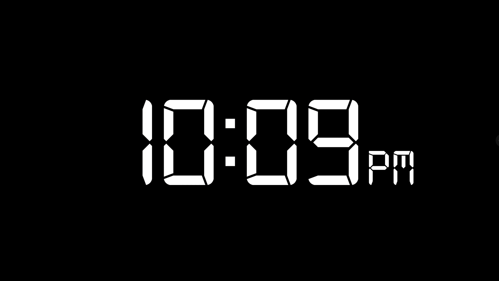

# FSCC WallClock - Amir Gorkovchenko (2022)

We had an issue where we couldn't find a proper wallclock software that was seamless and lightweight enough and Good looking enough to present in a live setting on big screens.

This project was developed as a custom solution to this issue.

Is is a clean and customizable wallClock software that can be controlled via UDP commands.
It has also been adapted to work together with BitFocus Companion to give live status updates

This WallClock has been tested on Mac devices and Windows devices and is completely portable with a built in java runtime.

This REQUIRES the processing IDE to compile and package properly. This is programmed solely in Java.

# Usage
Use the processing IDE to run or package the wallclock.

On initial run, the software will attempt to create a template ini configuration file.

This file gives options such as Clock font, format, size, positioning, bg color, and text color.

This ini config is also used to set up UDP ports that can receive commands remotely.

# Photos
